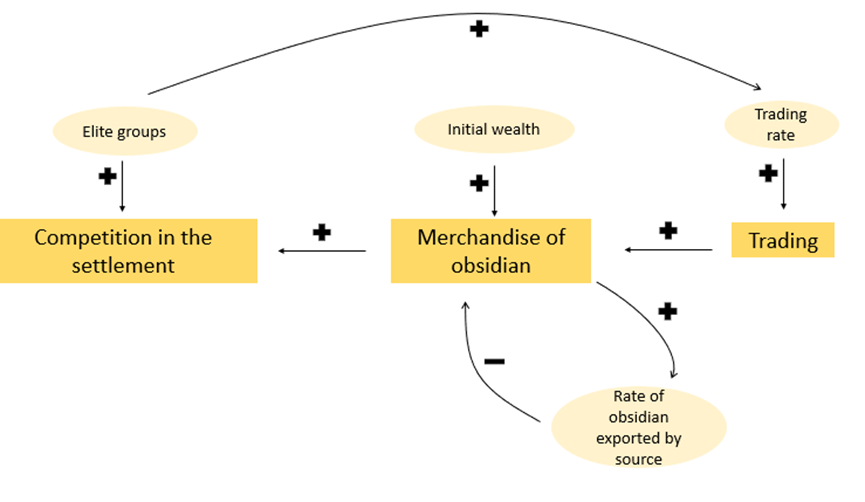

# Obsidian-glass-trade-model-and-Social-Competition
A NetLogo trade model for obsidian glass in the Aegean

## Context
This Agent-Based Model (ABM) explores the emergence of social hierarchy and elite competition through the trade of **obsidian glass** in a prehistoric context. Obsidian is a valuable volcanic glass used for tools and decoration, found only in specific Aegean sources like Melos. Its presence in distant settlements, such as those in Macedonia, serves as primary evidence of established trading networks and the economic power of individuals who could afford its acquisition.

### Conceptual Model
* **Evidence:** A significant quantity of obsidian from Melos found in a Late Bronze Age semi-mountainous settlement in Macedonia, Greece.
* **Phenomenon:** Frequent use of obsidian facilitated by long-distance trading relationships (over 700 km) between the Macedonian settlement and the source in Melos.
* **Mechanism:** The evolution of trading and product exchange allowed prestigious groups within the settlement to compete and establish a hierarchical social structure.

---

## Model Dynamics & Elements

### Elements
* **Origin Settlement:** The source of obsidian (island of Melos).
* **Target Terrain:** A semi-mountainous settlement in Macedonia.
* **Agents:** Elites and Commoners.
* **Initial Wealth:** Pre-existing resources (livestock, land) required to acquire obsidian.
* **Route:** The logistical path of the merchandise.

### Key Mechanisms
1. **Initial Wealth:** Controlled by the user, representing the starting economic power of agents.
2. **Obsidian Export Rate:** Controls the supply flow from the source (Melos).
3. **Positive Feedback Loop:** Purchase of obsidian → Increased Competition → Higher Trading Rate → More Purchases.
4. **Social Evolution:** Elites "hatch" new elite members upon accumulating sufficient obsidian, representing family expansion and class growth.

---

## How to Use
1. **Open** the NetLogo file you will find in this repository.
1. **Setup:** Press the **Setup** button to initialize the settlement, terrain, and agents.
2. **Configure Parameters:**
   * Use the `initial-wealth-slider` to set the starting economic power.
   * Adjust the `obsidian-export-rate` to control the supply flow from the source.
   * Adjust `obsidian-purchase-amount` to observe how aggressive trading affects status and the overall trading rate.
3. **Run:** Press the **Go** button to run the simulation.

### Visuals
* **Red Agents:** **Elites** Size scales dynamically with their competition level.
* **Black Agents:** **Commoners** A static population used for social contrast.
* **Brown Area:** The boundaries of the semi-mountainous settlement.
* **Green Area:** The flat land surrounding the settlement.

---

## References & Acknowledgments
This model was developed as part of the **ABM in Archaeology** curriculum.

* **Course Material:** [Agent-Based Modeling in Archaeology: A Course Guide](https://codarchlab-abm.github.io/course-guide/).
* **Institution:** Computational Archaeology Laboratory (CodArchLab).
* **Code Attribution:** Parts of the trading logic and agent interaction patterns were adapted from the **"Pond Trade"** model (NetLogo Models Library).
* **AI Assistance:** AI tools (Gemini) were utilized for code optimization, debugging, and refining feedback loops to align with the conceptual framework.
* **Conceptual Framework:** The model's feedback loops and population dynamics are based on modules provided by the instructor regarding resource dynamics in archaeological contexts.
